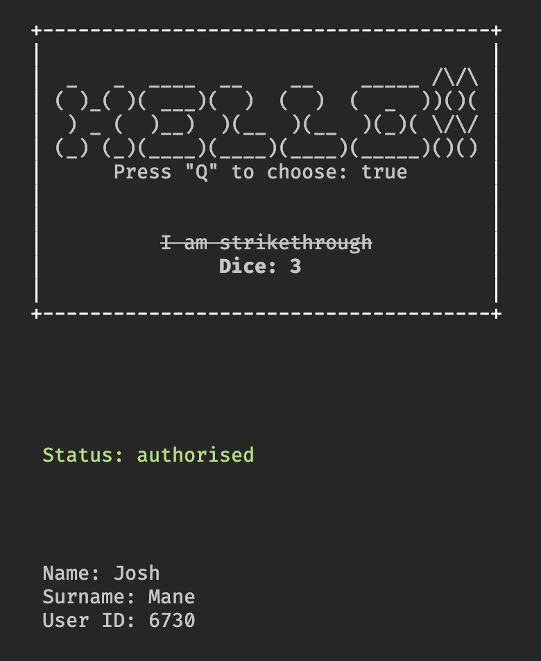

# State management in React workshop

A react workshop built to compare the state management strategies performance in React. We illustrate the different approaches and best practices releated to component state injection creation using atomic state selection. 

This is a CLI porject. We deliberately remove the "styling" part of React to focus on its architecture. We will create an

- Original class component approach using context providers and consumers
- Context with hooks: Best Practices 
- State management Library example using [Zustand](https://github.com/pmndrs/zustand)

The project was bootstraped using
[create-ink-app](https://github.com/vadimdemedes/create-ink-app)

```bash
$ npm install
$ npm start
```

